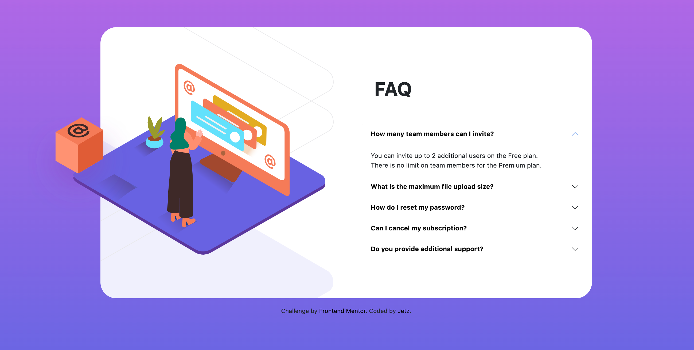

# Frontend Mentor - FAQ accordion card solution

 Challenge [NFT preview card component challenge on Frontend Mentor](https://www.frontendmentor.io/challenges/nft-preview-card-component-SbdUL_w0U). ⬅️

This is my solution to the FAQ accordion card component challenge on Frontend Mentor.

 ### Screenshot

### Links

- [Solution Frontend Mentor](https://www.frontendmentor.io/solutions/nft-preview-card-using-css-zEOVlGs1B)   ⬅️

- [Live Site URL](https://jcjetz.github.io/Frontend-Mentor-FAQ-Accordion-Card/)

### The challenge

Users should be able to:

- View the optimal layout for the component depending on their device's screen size
- See hover states for all interactive elements on the page
- Hide/Show the answer to a question when the question is clicked

- **Bonus**: Complete the challenge without using JavaScript 🎊

### Useful resources  

- ⭐ [CSS Selector Reference](https://www.w3schools.com/cssref/css_selectors.asp)

- ⭐ [CSS media queries](https://developer.mozilla.org/es/docs/Web/CSS/Media_Queries/Using_media_queries)

- ⭐ [More media queries](https://www.mclibre.org/consultar/htmlcss/css/css-media-queries.html)

- ⭐ [Collapse](https://getbootstrap.com/docs/4.3/components/collapse/#accordion-example)

- ⭐ [rem Converter](https://nekocalc.com/px-to-rem-converter)

### Built with

- HTML
- CSS 
- Flex
- Grid
- ✅ I have done this challenge using bootstrap.

